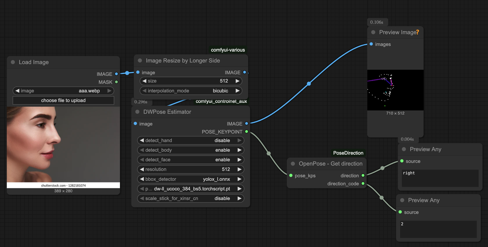

# OpenPose - Get Direction Node

This custom node for ComfyUI analyzes OpenPose keypoints to determine if a person in an image is facing **forward**, showing their **left** side, or their **right** side.

## Features
- **Robust direction detection** using body (shoulders, nose) and face keypoints (if available)
- Returns both a string (`"forward"`, `"left"`, `"right"`) and an integer code (`0` for forward, `1` for left, `2` for right)
- Designed for use with OpenPose COCO-format keypoints (e.g., `dw-ll_ucoco_384.onnx`)

## How It Works
- The node examines the position of the nose relative to the shoulders and, if available, the symmetry of face keypoints (eyes and mouth corners).
- If the nose is centered between the shoulders and the face is symmetric, the person is considered to be facing **forward**.
- If the nose is offset to one side and the face is not symmetric, the node determines if the person is showing their **left** or **right** side.

## Output
- `direction` (string): One of `"forward"`, `"left"`, or `"right"`
- `direction_code` (int):
  - `0` = forward
  - `1` = left
  - `2` = right

## Example Results

### Forward

### Left

### Right

## Usage
1. Add the node to your ComfyUI workflow.
2. Connect the output of your OpenPose node (with COCO-format keypoints) to the `pose_kps` input of this node.
3. The node will output the direction as both a string and an integer code.

## Test Workflow
A sample workflow is provided to test the node:

- [Test Detection Workflow](workflow/test_detection.json)

You can load this workflow in ComfyUI to see the node in action with example images and keypoints.

---

**Author:** Alessandro Zonta

[License](LICENSE) 